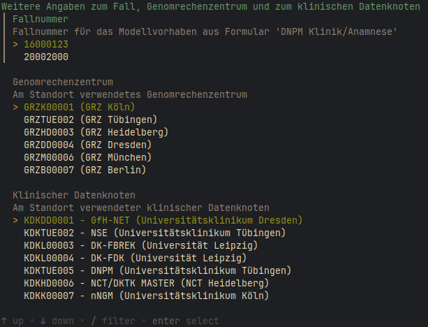

# Onkostar Extraktion von GRZ-Metadaten

Ziel dieser Anwendung ist das Bereitstellen einer Vorlage für GRZ-Metadaten mit einigen Daten, extrahiert aus
der Onkostar-Datenbank.

## Anwendung

Der Parameter `--help` zeigt folgenden Hilfetext an

```
Usage: os2grzmeta --user=STRING --sample-id=STRING --filename=STRING [flags]

A simple tool to export GRZ metadata template from Onkostar database

Flags:
  -h, --help                   Show context-sensitive help.
  -U, --user=STRING            Database username
  -P, --password=STRING        Database password
  -H, --host="localhost"       Database host
      --port=3306              Database port
      --ssl="false"            SSL-Verbindung ('true', 'false', 'skip-verify', 'preferred')
  -D, --database="onkostar"    Database name
      --sample-id=STRING       Einsendenummer
      --filename=STRING        Ausgabedatei
```

Wird der Parameter `--password` nicht verwendet, wird das Datenbankpasswort abgefragt.

Werden für eine Proben-(Einsende)-Nummer mehrere zugeordnete Fallnummern ermittelt, wird die Fallnummer erfragt.
Weiterhin wird das verwendete GRZ und der KDK abgefragt.

Es können zudem für LabData-Angaben Profile ausgewählt werden, die Standardwerte setzen.
Enthalten sind aktuell Standardwerte für das UK Würzburg.



Die Angaben zum MV-Consent in der Ausgabedatei beziehen sich auf die ausgewählte Fallnummer.